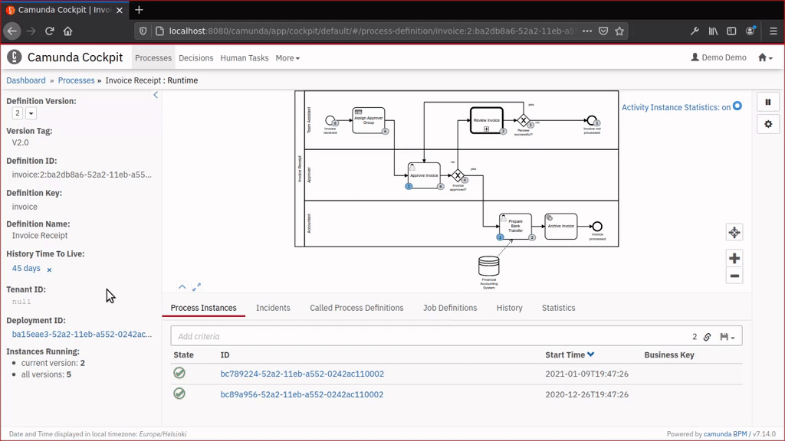

Minimal "history plugins" for Operaton and Camunda 7 Cockpit
============================================================



Breaking changes
----------------

* [2021-08-13](https://github.com/datakurre/operaton-cockpit-plugins/tree/66888bcb36f351880835b007b5e75dc44c732fb9): Change definition view plugins (historic activities and instances) to only show data for the current definition version

* [the last version before this changelog](https://github.com/datakurre/operaton-cockpit-plugins/tree/608f7f1d2c240c810dac466890decb91f4da5688)


Try it
------

With Camunda Platform 7.14.0 and 7.20.0 or later:

```bash
$ git clone https://github.com/datakurre/operaton-cockpit-plugins.git
$ docker run --rm -p 8080:8080 -v $(pwd)/operaton-cockpit-plugins:/camunda/webapps/camunda/app/cockpit/scripts/:ro camunda/camunda-bpm-platform:7.14.0
```

With Camunda Platform 7.15.0 to 7.19.0:

```bash
$ git clone https://github.com/datakurre/operaton-cockpit-plugins.git
$ docker run -d --name mytemp camunda/camunda-bpm-platform:7.15.0
$ docker cp mytemp:/camunda/webapps/camunda/app/cockpit/scripts/camunda-cockpit-ui.js operaton-cockpit-plugins
$ docker rm -vf mytemp
$ docker run --rm -p 8080:8080 -v $(pwd)/operaton-cockpit-plugins:/camunda/webapps/camunda/app/cockpit/scripts/:ro camunda/camunda-bpm-platform:7.15.0
```

See also the example [Dockerfile for Camunda Run 7.15.0](https://github.com/datakurre/operaton-cockpit-plugins/issues/16#issuecomment-874499953).

If you don't immediately see the plugin, try again with your browser's private browsing mode. It is a common issue browser has cached a previous Cockpit plugin configuration without these plugins.

Note: Trying out the plugins with Camunda Platform 7.15.0 Docker image is more complex than with the previous version 7.14.0, because the new location of `camunda-cockpit-ui.js` prevents simple override of the scripts folder.


Use it
------

### Spring Boot

Copy `config.js` and the files it references to `./src/main/resources/META-INF/resources/webjars/operaton/app/cockpit/scripts`. Once you are done, your project structure should look like this:
```shell
src/main/resources/
├── META-INF
│   ├── resources
│   │   └── webjars
│   │       └── operaton
│   │           └── app
│   │               └── cockpit
│   │                   └── scripts
│   │                       ├── config.js
│   │                       ├── definition-historic-activities.js
│   │                       ├── instance-historic-activities.js
│   │                       ├── instance-route-history.js
│   │                       ├── instance-tab-modify.js
│   │                       ├── robot-module.js
│   │                       ├── tasklist-audit-log.js
│   │                       └── tasklist-config.js
```
After this you can start the project and the plugin should be loaded. Usually, you customize config.js per project and define there which plugins are included and where the browser should find them. You may use a browser network inspector to check that Cockpit loads your version of config.js and also the plugin JavaScript files get loaded.

For use with Camunda 7, use directory `./src/main/resources/META-INF/resources/webjars/camunda/app/cockpit/scripts` instead.


### Other Distributions

[Check the forum discussion on how to package plugins for various alternative Camunda distributions.](https://forum.camunda.org/t/minimal-cockpit-history-plugins-for-camunda-7-14-0/24651)


Develop it
----------

```bash
$ cd operaton-cockpit-plugins
$ npm install
$ npm run watch
```

When the scripts are mounted into running Docker container, development changes are immediately available in the container with page refresh.
